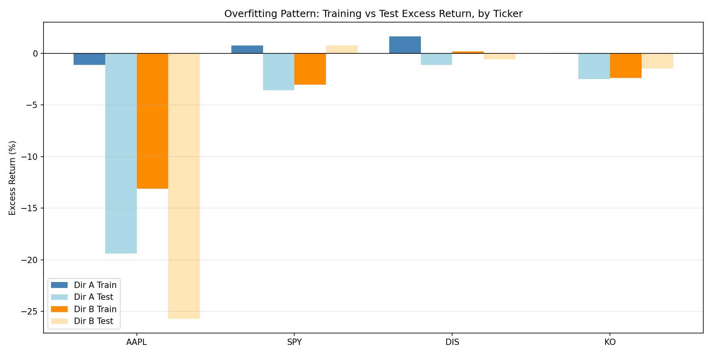
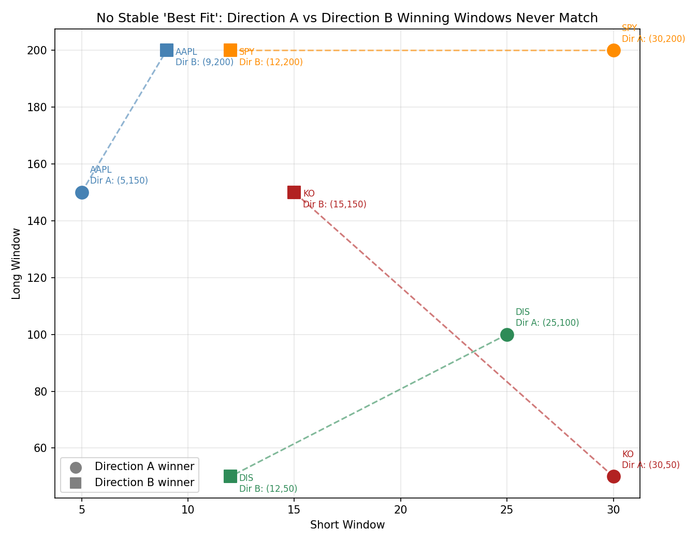
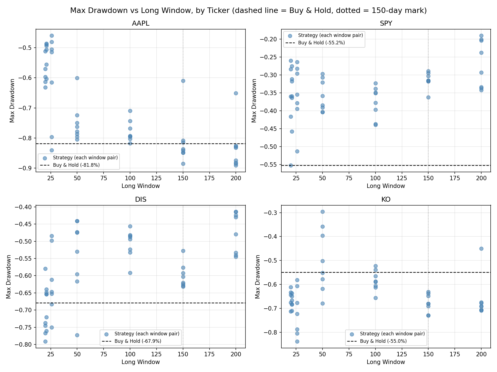
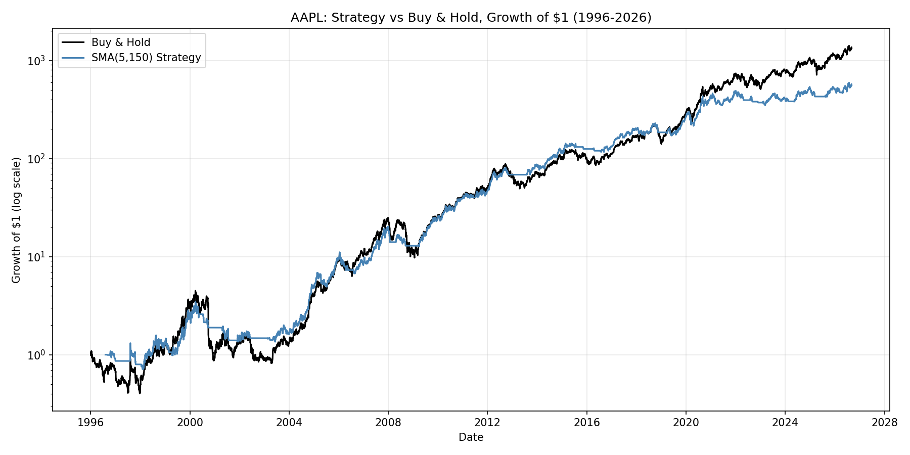

# Does SMA Crossover Beat Buy-and-Hold? A Multi-Ticker, Out-of-Sample Investigation

## Abstract

Simple moving average (SMA) crossover strategies are among the most widely referenced technical trading rules, promising to capture upside trends while sitting out drawdowns. This study tests whether that promise holds up: SMA crossover is tested against a buy-and-hold benchmark across four tickers (AAPL, SPY, DIS, KO) spanning 30 years of daily price data (1996-2026), using a two-directional train/test design, a full-period hindsight ceiling check, risk-adjusted performance metrics, and realistic transaction costs. Across every method of evaluation, SMA crossover failed to demonstrate a durable, generalizable edge over buy-and-hold. This is driven in part by a structural limitation of the strategy itself: trades are placed one day behind the signal that triggers them, meaning the strategy is always confirming a trend after it has already begun to move, and in part by market conditions, since much of the test period, particularly since the 2009 financial-crisis recovery, has been an unusually strong and sustained bull market, an environment in which any strategy that periodically exits the market forfeits a share of relentless compounding it can rarely make back. This does not mean SMA crossover never works. Rather, it means that over a long period dominated by sustained upward compounding, buying and holding is a very difficult benchmark to beat. In the course of testing this, the study also surfaced a broader methodological point: the window pair identified as "optimal" in-sample consistently failed to generalize out-of-sample and shifted substantially depending on which historical period was used to select it, a pattern consistent with backtest overfitting rather than genuine signal.

---

## Executive Summary

This project tests whether a simple moving average (SMA) crossover trading strategy can beat a buy-and-hold benchmark, across four tickers (AAPL, SPY, DIS, KO) and 30 years of daily price history (1996-2026). Across every validation method applied, it could not: SMA crossover consistently underperformed buy-and-hold, whether measured on raw return, out-of-sample tested return, or even a full-period hindsight ceiling with no restriction on foresight.

Part of this result is structural: SMA crossover trades on the *prior* day's signal, so by the time a crossover confirms a trend, that trend has already been underway. The strategy is always reacting a step late. Part of it is regime-specific: much of the 30-year test window, and especially the years since the 2009 financial-crisis recovery, has been an extraordinarily strong and sustained bull market. In an environment where the market mostly climbs with few deep, lasting pullbacks, a strategy that periodically exits to protect against declines gives up participation in exactly the gains it can least afford to miss, and because gains compound, that gap widens over time rather than closing. This is a property of the market regime tested, not proof the strategy can never work; a period with more sustained declines could plausibly tell a different story.

Using a two-directional train/test (reverse validation) design, a full-period hindsight ceiling check, risk-adjusted metrics (Sharpe Ratio, Max Drawdown), and realistic transaction costs, three consistent findings emerged. An Overfitting Pattern: window pairs that appeared to beat buy-and-hold during training consistently failed once tested on unseen data, in 5 of 8 train/test trials. In the remaining 3, the strategy never found a genuine in-sample edge at all, an even more direct form of failure. One trial (SPY, Direction B) showed the reverse pattern, most plausibly attributable to chance.

The tests also revealed Parameter Instability: the "best" window pair shifted substantially depending on which historical period was used to select it, for all four tickers, once transaction costs were included. There is no stable, discoverable optimal window for any ticker tested.

The strategy did meaningfully reduce worst-case losses relative to buy-and-hold for three of four tickers (SPY, DIS, and AAPL below a ~150-day long window), but this benefit reversed for AAPL's longest windows and was largely absent for KO.

Buy-and-hold outperformed the best available SMA crossover strategy on raw return in every single test conducted, including a full 30-year hindsight-optimal comparison with no restrictions on foresight, for three of the four tickers. Only DIS's hindsight-best pair beat buy-and-hold on the full 30-year period, and even that result did not survive honest, out-of-sample validation in either direction.

---

## 1. Methodology

### 1.1 The Strategy

The SMA crossover strategy computes two rolling averages of daily closing price: a "short" window and a "long" window. When the short-window average rises above the long-window average, the strategy holds a long position (fully invested); when it falls below, the strategy exits to cash. Daily strategy returns are calculated using the *prior* day's signal, so the backtest never uses information unavailable at the time a trade would have been placed.

### 1.2 Parameter Space

50 short/long window combinations were tested per ticker, spanning short windows of 5-30 days and long windows of 20-200 days, including several combinations commonly referenced in retail trading literature (5/20, 9/21, 10/20, 12/26, 50/200 "Golden Cross").

### 1.3 Validation Design

Three distinct tests were run for each ticker, using 30 years of daily price data (1996-2026):

- **Direction A**: the full grid of window pairs was ranked using only 1996-2011 data ("training"). The single best-performing pair was then re-run, unchanged, against 2011-2026 data it had never seen ("testing").
- **Direction B**: the reverse, trained on 2011-2026, tested on 1996-2011.
- **Full-Period Hindsight Check**: every window pair was also tested against the *entire* 30-year period at once. This is explicitly **not** a valid trading strategy, since no real trader could have selected a window pair using data from its own future, but it establishes an upper bound: does *any* window pair beat buy-and-hold, even with unrestricted foresight?

### 1.4 Risk-Adjusted Metrics

Alongside total return, two additional metrics were calculated for every backtest.

**Sharpe Ratio**, return earned per unit of volatility, annualized:

\[
\text{Sharpe Ratio} = \frac{\bar{r} - R_f}{\sigma_r} \times \sqrt{252}
\]

Where:

* $\bar{r}$ is the mean return of the strategy.
* $R_f$ is the risk-free rate, assumed to be $0$ in this analysis.
* $\sigma_r$ is the standard deviation of the strategy's returns.
* $\sqrt{252}$ annualizes the ratio, assuming daily returns and 252 trading days in a year.

The Sharpe Ratio's traditional purpose is to compare an investment's risk-adjusted return against a "risk-free" alternative, typically short-term government debt (such as Treasury Bills) or cash, since those are considered to carry essentially zero risk of loss. The formula asks: how much extra return is being earned, per unit of risk taken, for choosing this risky investment instead of simply holding a safe, government-backed security? This is why the formula traditionally subtracts $R_f$ (the short-term government debt or cash rate) from the investment's return before dividing by volatility. Here, however, the comparison of interest is between the strategy and buy-and-hold on the same underlying asset, not against a risk-free alternative, so a risk-free rate of zero was assumed. With $R_f = 0$, the formula reduces to $\bar{r}/\sigma_r \times \sqrt{252}$. Since this same simplification is applied identically to both the strategy and buy-and-hold, and since typical risk-free rates are small relative to the return spreads observed in this study (often hundreds to tens of thousands of percentage points), including a nonzero $R_f$ would shift both Sharpe Ratios by a similarly small amount without materially changing which strategy ranks higher.

**Max Drawdown**, the largest peak-to-trough decline in cumulative portfolio value over the test period:

\[
\text{Max Drawdown} = \min \left\{ \frac{V_t - \max_{s \le t} V_s}{\max_{s \le t} V_s} \; : \; t = 1, 2, \ldots, T \right\}
\]

Where:

* $V_t$ is the cumulative value of the portfolio at time $t$.
* $\max_{s \le t} V_s$ is the highest cumulative value observed at any point up to and including time $t$ (the running peak).
* $T$ is the total number of days in the time series.
* The curly braces denote the set of values obtained by computing the expression for every day $t$ from $1$ to $T$; $\min\{\cdot\}$ then selects the smallest (most negative) value from that set, the single worst decline from any prior peak.

Max Drawdown answers a different question than Sharpe Ratio. Rather than measuring return relative to volatility on average, it captures the single worst outcome an investor would have actually lived through: the largest percentage loss from any high point to the lowest point that followed it, before a new high was eventually reached. This makes it a useful complement to Sharpe Ratio for evaluating a strategy like SMA crossover, whose core rationale is not necessarily to earn a smoother average return, but specifically to avoid being invested during the most severe declines. A strategy could show a similar or even worse Sharpe Ratio than buy-and-hold while still meaningfully reducing Max Drawdown, if it tends to sit out sharp crashes but also misses some ordinary day-to-day gains along the way. Measuring both metrics side by side allows these two distinct effects, smoother average risk-adjusted return versus protection from the single worst decline, to be evaluated separately rather than conflated into one number.

### 1.5 Transaction Costs

A simplified transaction cost of 0.1% (combining estimated commission and slippage) was applied to every trade, every time the strategy's signal flipped from bullish to bearish or vice versa. This is a standard simplifying assumption; real-world costs vary by broker, order size, and liquidity. Re-running the full analysis with this cost included did not change any of the three core findings. If anything, it strengthened the parameter instability finding (see Section 4), since it removed the one ticker (SPY) that had previously shown identical windows in both directions.

### 1.6 Tickers Tested

Four tickers were selected specifically to represent different growth/volatility profiles, to test whether findings from a single stock would generalize:

| Ticker | Profile | Rationale |
|---|---|---|
| AAPL | Extreme, sustained compounder | The original stock tested; among the strongest 30-year performers in market history |
| SPY | Diversified broad market index | Tests whether findings hold for "the market" generally, not one exceptional company |
| DIS | Choppy, non-monotonic (multi-year declines and recoveries) | Deliberately chosen as a favorable case for trend-following, which is theoretically suited to volatile, range-bound conditions |
| KO | Slow, low-volatility, mature blue chip | A middle-ground control between AAPL's extremity and DIS's volatility |

---

## 2. Cross-Ticker Summary (Full 30-Year Hindsight)

The single best-performing window pair per ticker, tested with unrestricted hindsight across the entire 1996-2026 period:

| Ticker | Best Window | Buy & Hold Return | Strategy Return | Excess Return | B&H Sharpe | Strategy Sharpe | Market Max DD | Strategy Max DD |
|---|---|---|---|---|---|---|---|---|
| AAPL | (5, 150) | 133,103.5% | 55,858.7% | -77,244.7% | 0.78 | 0.83 | -81.8% | -61.0% |
| SPY | (12, 200) | 1,997.5% | 1,395.2% | -602.3% | 0.61 | 0.78 | -55.2% | -19.0% |
| DIS | (25, 100) | 612.1% | 805.6% | **+193.4%** | 0.36 | 0.46 | -67.9% | -49.4% |
| KO | (30, 50) | 923.8% | 295.3% | -628.6% | 0.46 | 0.38 | -55.0% | -29.6% |

DIS is the only ticker where a window pair beat buy-and-hold on raw return, even with full hindsight. This is a notable result, but one that does not survive honest out-of-sample testing (see Section 3).

---

## 3. The Overfitting Pattern

Across 8 total train/test trials (4 tickers x 2 directions, with transaction costs included):

| Ticker | Direction | Train Excess Return | Test Excess Return | Overfitting Confirmed |
|---|---|---|---|---|
| AAPL | A | -110.5% | -1,939.5% | No, no in-sample edge to begin with |
| AAPL | B | -1,311.8% | -2,573.3% | No, no in-sample edge to begin with |
| SPY | A | +76.5% | -357.5% | **Yes** |
| SPY | B | -303.5% | +76.3% | No, reversed pattern (loss in training, gain in test) |
| DIS | A | +165.9% | -110.2% | **Yes** |
| DIS | B | +17.9% | -57.9% | **Yes** |
| KO | A | -4.4% | -250.6% | No, no in-sample edge to begin with |
| KO | B | -237.1% | -145.6% | No, no in-sample edge to begin with |

The classic overfitting signature, a genuine in-sample win collapsing out-of-sample, was directly confirmed in 3 of 8 trials. The remaining 5 trials fall into two further categories, worth distinguishing explicitly:

- **No in-sample edge was ever found** (AAPL, both directions; KO, both directions): every window pair underperformed buy-and-hold even during training, before out-of-sample testing was applied. This is arguably a *stronger* form of the same underlying finding than classic overfitting. SMA crossover failed to identify durable value regardless of which period was used to search for it, meaning there was no edge to lose in the first place.
- **A reversed pattern** (SPY, Direction B): a training-period loss followed by a test-period gain. This is most plausibly attributable to chance rather than a genuine signal, and is reported here in the interest of completeness rather than omitted for not fitting the pattern cleanly.

An apparent "winning strategy," discovered by testing many parameter combinations against historical data, cannot be trusted to perform similarly on new data unless it has been validated out-of-sample.

---

## 4. Parameter Instability

If SMA crossover strategies captured a genuine, durable property of a stock's price behavior, the "optimal" window pair should be roughly consistent regardless of which historical period was used to discover it. Instead, every single ticker showed drift between Direction A's winning pair and Direction B's winning pair:

| Ticker | Direction A Winner | Direction B Winner | Short-Window Diff | Long-Window Diff | Same Window? |
|---|---|---|---|---|---|
| AAPL | (5, 150) | (9, 200) | 4 | 50 | No |
| SPY | (30, 200) | (12, 200) | 18 | 0 | No |
| DIS | (25, 100) | (12, 50) | 13 | 50 | No |
| KO | (30, 50) | (15, 150) | 15 | 100 | No |

All four tickers show meaningful drift, with long-window differences ranging from 0 to 100 days and short-window differences ranging from 4 to 18 days. Notably, in an earlier pass of this analysis (before transaction costs were added), SPY converged on the *identical* window pair, (12, 200), in both directions, a striking counter-example suggesting a diversified index might have more stable underlying behavior than an individual stock. Once realistic trading costs were included, SPY's short window diverged (30 vs. 12), and no stable case remained across any of the four tickers.

There is no single "correct" SMA window pair waiting to be discovered for any of these tickers. Whatever a grid search identifies as "optimal" is a function of the specific historical sample used, not a stable, transferable property. This is a hallmark of overfitting to noise rather than a real signal. This finding also suggests that apparent parameter stability observed in a frictionless backtest can be an artifact of the simplification itself, disappearing once realistic costs are introduced.

---

## 5. Drawdown Protection

Unlike the first two findings, drawdown protection showed real value, but not universally, and not with equal strength across every ticker.

| Ticker | Buy & Hold Max Drawdown | % of Window Pairs with Smaller Drawdown |
|---|---|---|
| AAPL | -81.8% | 74% |
| SPY | -55.2% | 98% |
| DIS | -67.9% | 82% |
| KO | -55.0% | 14% |

**AAPL and KO** both show a threshold effect: drawdown protection deteriorates or reverses once the long window reaches roughly 150 days or more. For AAPL, the average strategy drawdown improves to -66.2% for long windows under 150 days, but worsens to -82.3% (essentially matching buy-and-hold) for long windows of 150 days or more. This is consistent with the intuition that a very slow-reacting average fails to exit a position before most of a decline has already occurred.

**SPY and DIS** show no such threshold breakdown. Protection remains strong even at 150-200 day long windows.

**KO is the clear outlier**: only 14% of window pairs produced a smaller drawdown than simply holding the stock, the lowest protection rate of any ticker tested, by a wide margin. KO's slow, low-volatility, gradually-trending price behavior appears to work against a trend-following approach, since there is no sharp, fast decline for the strategy to sidestep the way there was during, for example, the 2020 COVID crash or the dot-com bust that shaped AAPL, SPY, and DIS's histories.

SMA crossover's theoretical advantage, sitting out severe drawdowns, is real, but conditional on both the window pair chosen and the specific character of the underlying stock's price behavior. It should not be assumed to transfer automatically from one asset to another.

---

## 6. Cross-Ticker Perspective

AAPL's results, taken alone, are unusually one-sided: the stock compounded roughly 1,331x over 30 years, and no SMA window pair, even with full hindsight, could capture more than about 42% of that return.

*Note: log scale used due to the extreme magnitude of AAPL's total return; the visual gap between the two lines significantly understates the actual dollar/percentage difference.*

This reflects the mechanical reality that any strategy periodically exiting the market forfeits a share of extreme, sustained compounding, and that forfeiture is magnified the more extreme the compounding is.

Testing SPY, DIS, and KO confirmed that this is not solely an artifact of AAPL's exceptional performance. The overfitting and parameter instability findings held across all four tickers regardless of their growth profile. DIS stands out as the one case where a window pair beat buy-and-hold on raw return with full hindsight, but this advantage evaporated under honest train/test validation in both directions, reinforcing rather than undermining the overfitting finding. The drawdown protection finding, by contrast, did vary meaningfully by ticker, showing that not every conclusion generalizes equally. Some findings are closer to universal properties of the strategy family, while others depend on the specific asset being tested.

---

## 7. Limitations

**Transaction cost model is simplified.**
A flat 0.1% per trade was assumed; real costs vary by broker, order size, bid-ask spread, and market conditions.

**Only long/cash positions were modeled.**
No short-selling, leverage, or partial position sizing.

**Four tickers is a modest sample.**
The findings are consistent across all four tested, but a broader universe of stocks (across more sectors, market caps, and volatility regimes) would strengthen the generalizability claim further.

**The train/test split uses only two 15-year halves.**
A more granular walk-forward validation (e.g., rolling shorter windows) was not performed here and is a natural extension.

**MACD and other trend-following variants were not tested in this phase.**
They are a planned follow-up, given their conceptual similarity but different underlying mechanics (EMA-based, multi-line signal).

---

## 8. Conclusion

Across every validation method applied, regime-specific splits, two-directional reverse validation, and a full-period hindsight ceiling check, SMA crossover strategies failed to demonstrate a genuine, generalizable edge over buy-and-hold, across four tickers with meaningfully different growth and volatility characteristics. This result reflects both a structural limitation of the strategy (it always trades one day behind its own signal, so it is inherently reactive rather than predictive) and the character of the period tested, a market environment shaped substantially by a long, historically strong bull run since the 2009 financial-crisis lows, in which the cumulative compounding of simply holding a position is an unusually difficult benchmark to beat. This does not establish that SMA crossover is without merit in all conditions, only that over this long a horizon, dominated by sustained upward compounding, it was unable to keep pace.

The one property of the strategy family that held up with meaningful (if inconsistent) strength, reduced maximum drawdown, is real and worth taking seriously, but it is neither universal nor guaranteed: it depends on both the window pair selected and the underlying asset's specific price behavior, and it did not compensate for the return given up on any of the tickers tested here.

A secondary, methodological finding emerged in the course of this investigation: the specific parameters that appeared optimal during training were unstable across time for every ticker tested, and apparent in-sample "wins" consistently failed to survive out-of-sample validation, a pattern consistent with what the finance literature terms backtest overfitting. This underscores that any claimed strategy edge, in this domain or elsewhere, should be treated skeptically until it has been tested on data the selection process never saw.